# Lab3Web.
praktikum 3 (css)
# Laporan Praktikum Pemrograman Web - Lab3Web

## Identitas
- Nama: Rafif Mizanurohman
- Kelas: 1252A
- NIM: 312510377

## 1. Membuat Dokumen HTML

Membuat file `lab2_css_dasar.html` dan membuat struktur dasar HTML sesuai dengan modul praktikum.

### Screenshot
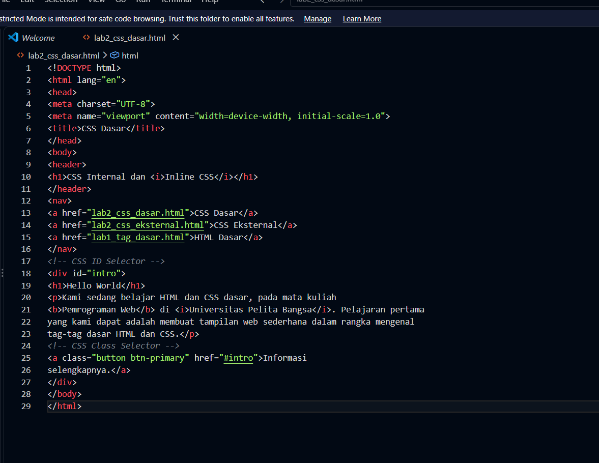
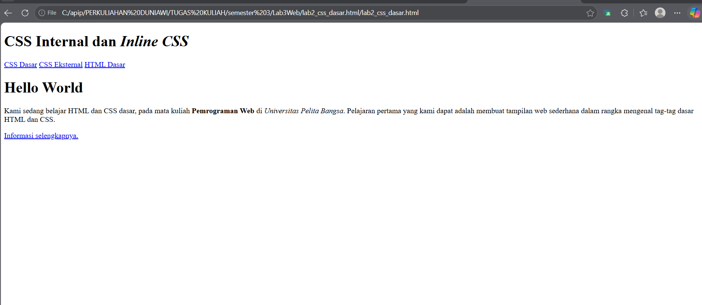

## 2. Mendeklarasikan CSS Internal

Menambahkan CSS Internal menggunakan tag `<style>` pada bagian `<head>` untuk mengatur tampilan halaman HTML.

### Screenshot
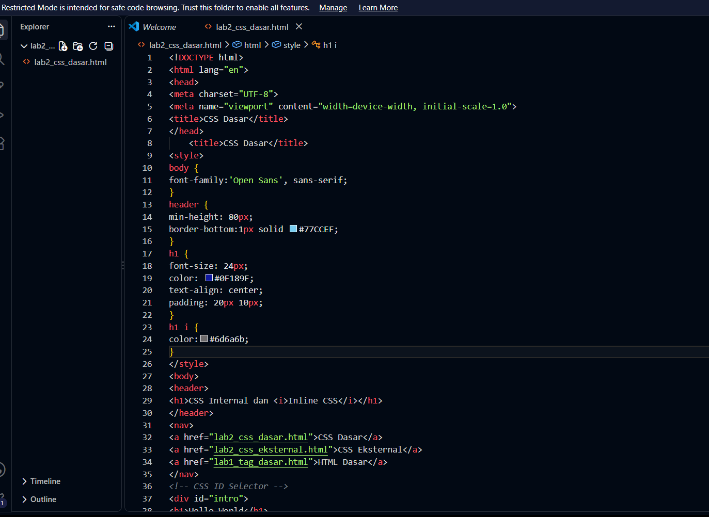
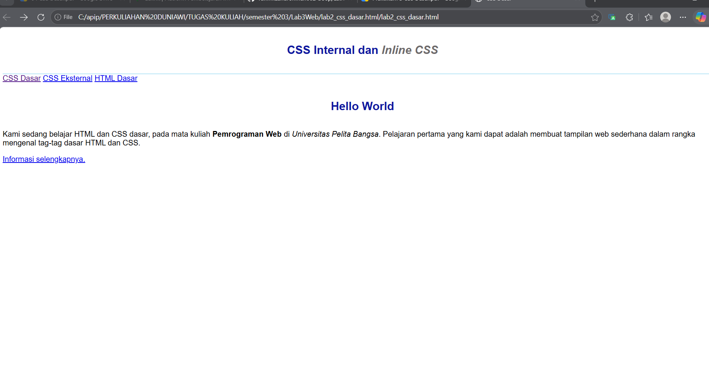

## 3. Menambahkan Inline CSS

Menambahkan CSS secara inline pada elemen `
` menggunakan atribut `style`.

### Screenshot
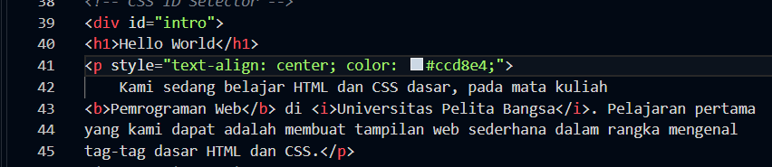
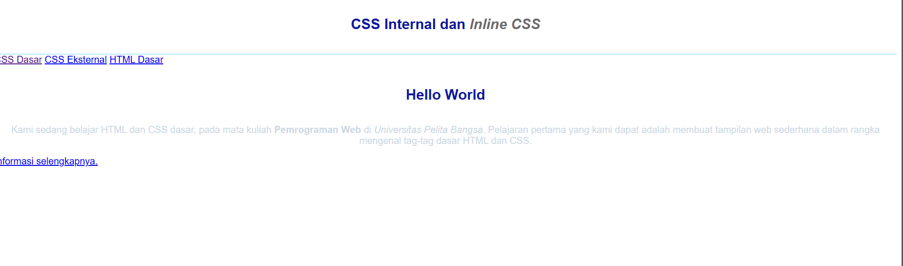

## 4. Membuat CSS Eksternal

Membuat file `style_eksternal.css` dan menghubungkannya dengan file HTML menggunakan tag `<link>`.

### Screenshot
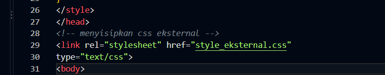
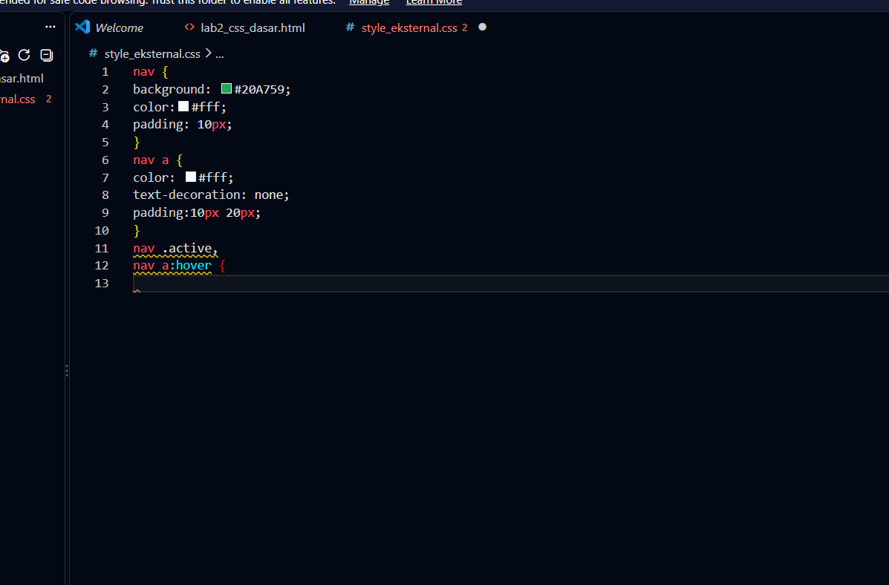
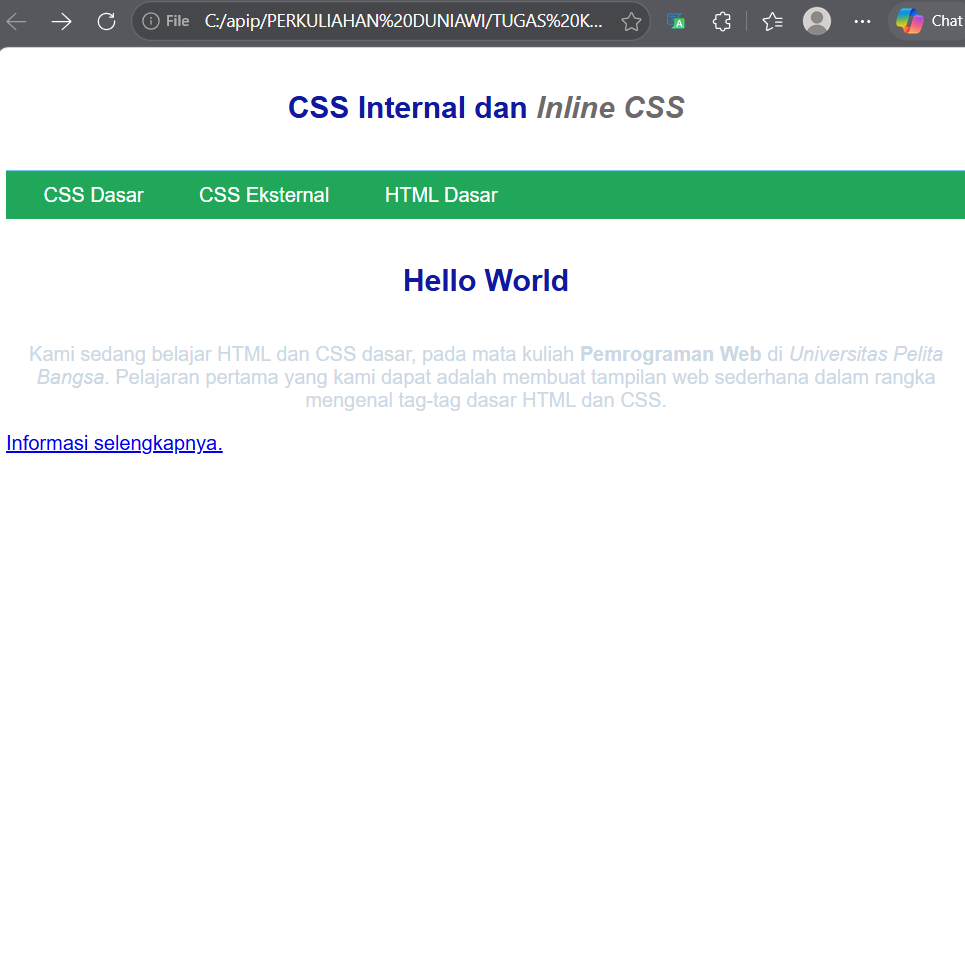

## 5. Menambahkan CSS Selector

Menambahkan Element Selector, ID Selector, dan Class Selector pada file `style_eksternal.css`.

### Screenshot
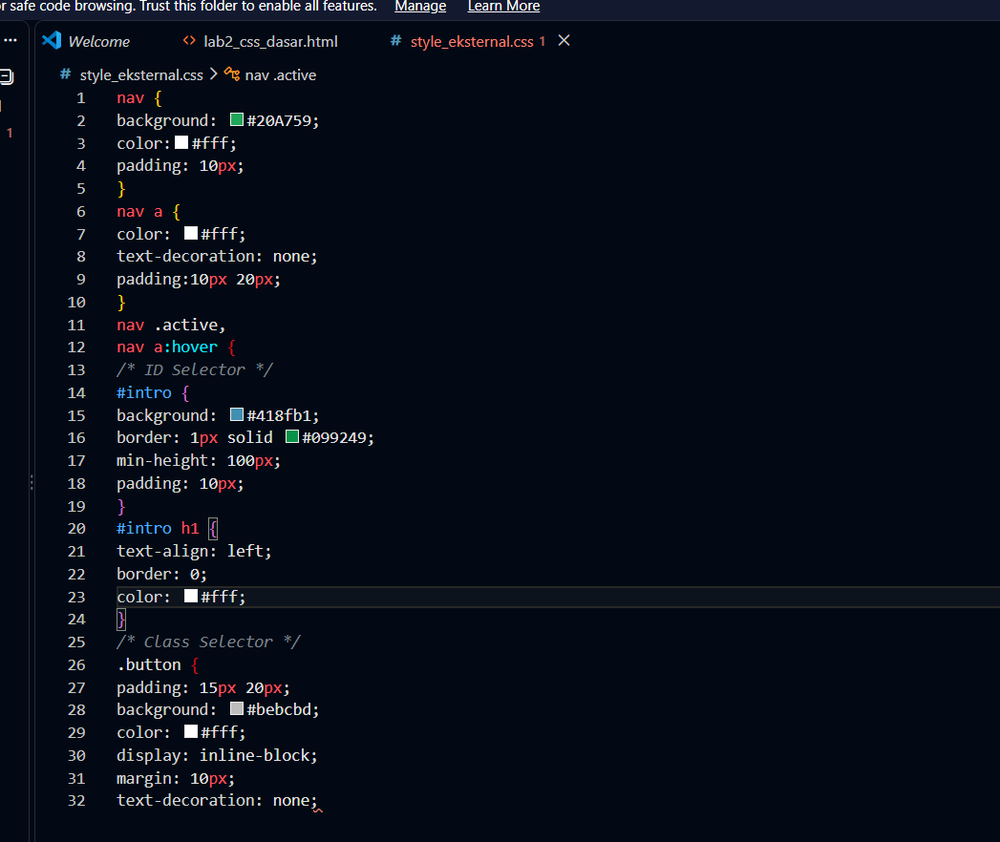
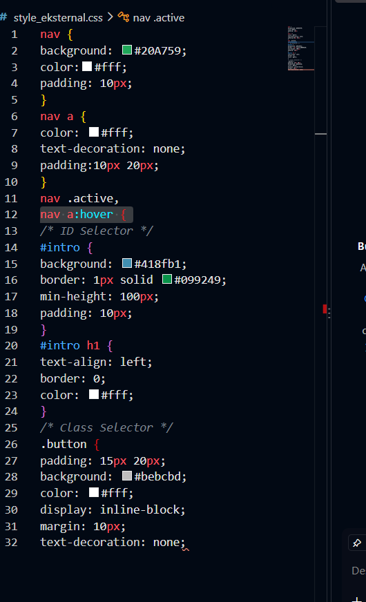
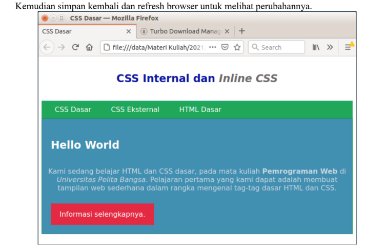

## 6. Eksperimen CSS

Melakukan perubahan dan penambahan properti CSS untuk melihat perubahan tampilan pada halaman web.

### Screenshot
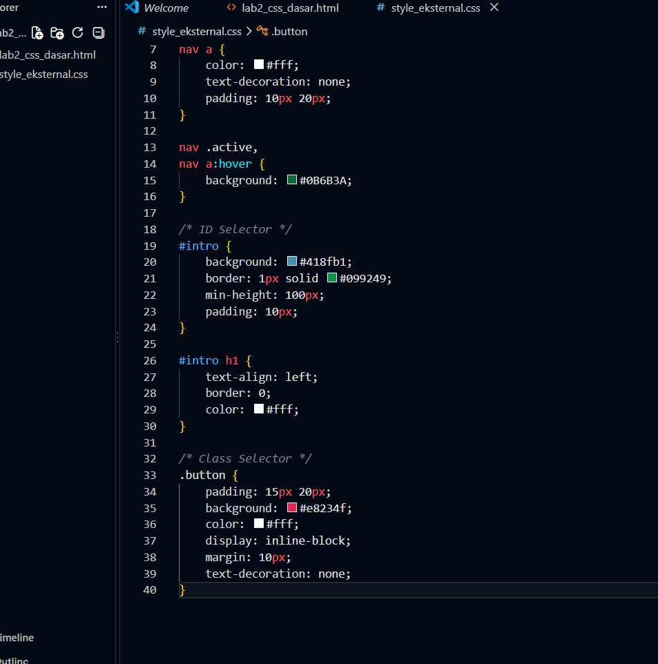
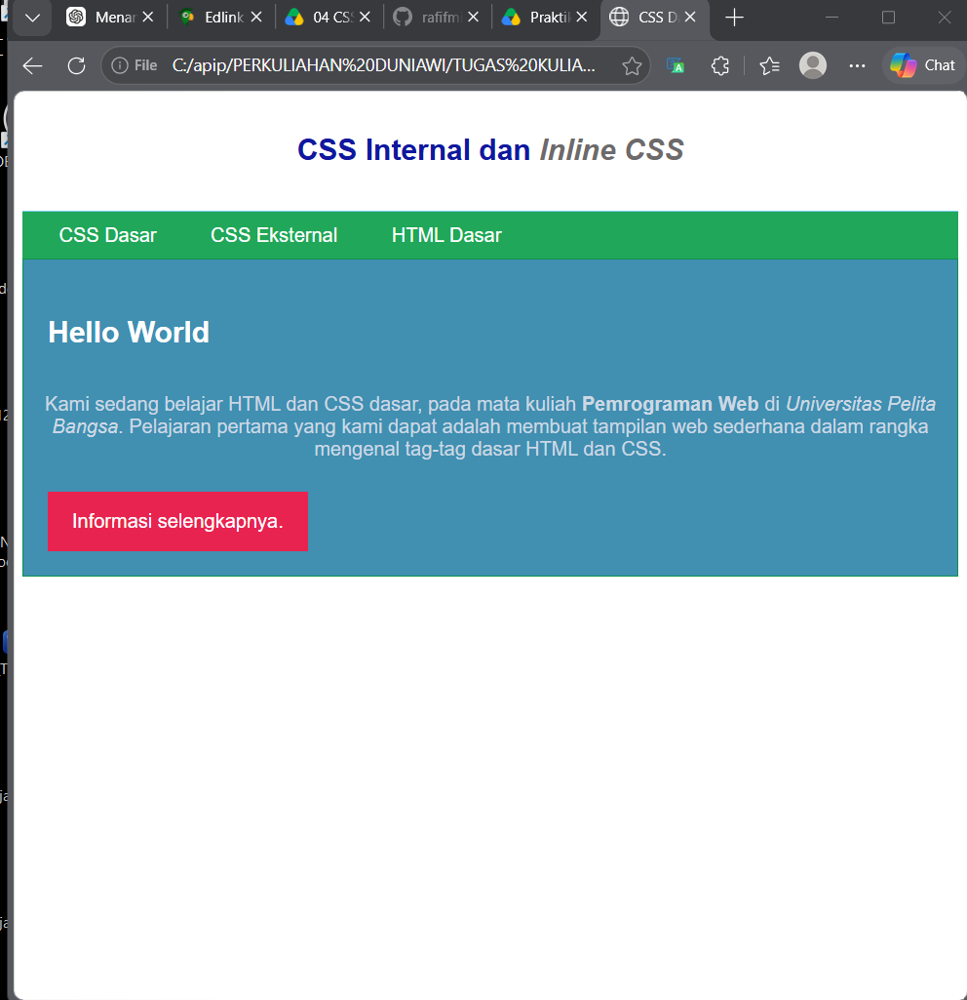

## Kesimpulan

Praktikum ini membantu memahami dasar CSS, cara penulisan CSS, penggunaan selector, serta penerapan CSS pada HTML.
